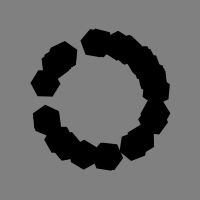
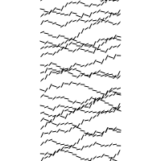

# Bella's Sketches

## Fibonacci

[drawning 1](Bella/fibonacci/Drawing_01.pv)

[drawning 2](Bella/fibonacci/Drawing_02.pv)

[drawning 3](Bella/fibonacci/Drawing_03.pv)

[drawning 4](Bella/fibonacci/Drawing_04.pv)

[drawning 5](Bella/fibonacci/Drawing_05.pv) 

## Random

[drawning 1](Bella/random/01_stipjes.pv)

[drawning 2](Bella/random/02_bollen.pv)

[drawning 3](Bella/random/03_rondjes.pv)

[drawning 4](Bella/random/04_pijltjes.pv)

[drawning 5](Bella/random/05_zeshoek.pv) 

## Perlin Noise

[drawning 1](Bella/perlin-noise/Noise_01.pv)

[drawning 2](Bella/perlin-noise/Noise_02.pv)

[drawning 3](Bella/perlin-noise/Noise_03.pv)

[drawning 4](Bella/perlin-noise/Noise_04.pv)

[drawning 5](Bella/perlin-noise/Noise_05.pv)

## Recursive functions

[drawning 1](Bella/recursive-functions/Recursive_01.pv)

[drawning 2](Bella/recursive-functions/Recursive_02.pv)

[drawning 3](Bella/recursive-functions/Recursive_03.pv)

[drawning 4](Bella/recursive-functions/Recursive_04.pv)

[drawning 5](Bella/recursive-functions/Recursive_05.pv)

            
