# Leonie's Sketches

## Fibonacci
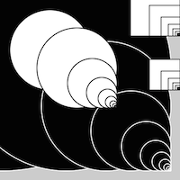
[drawing 1](Leonie/fib/fibonacci1pv.pv)
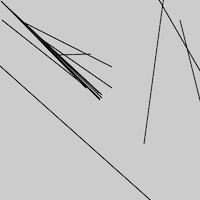
[drawing 2](Leonie/fib/fibonacci2pv.pv)
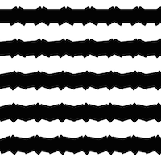
[drawing 3](Leonie/fib/fibonacci3pv.pv)
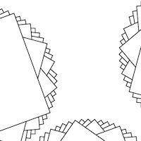
[drawing 4](Leonie/fib/fibonacci4pn.pv)
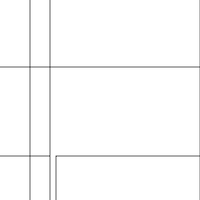
[drawing 5](Leonie/fib/fibonacci5.pv)

## Random
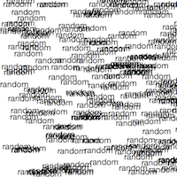
[drawing 1](Leonie/ran/random2_text.pv)
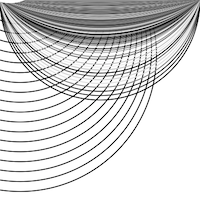
[drawing 2](Leonie/ran/random2.pv)
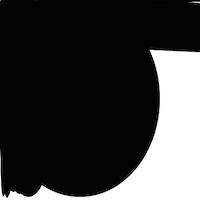
[drawing 3](Leonie/ran/random3.pv)
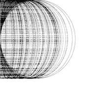
[drawing 4](Leonie/ran/random4.pv)
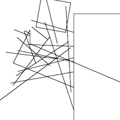
[drawing 5](Leonie/ran/random5.pv)

## Perlin Noise
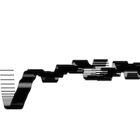
[drawing 1](Leonie/per/perlinnoise1.pv)
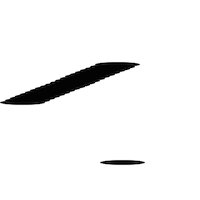
[drawing 2](Leonie/per/perlinnoise2.pv)
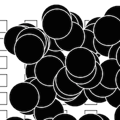
[drawing 3](Leonie/per/perlinnoise3pv.pv)
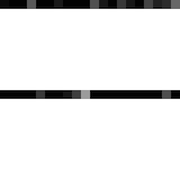
[drawing 4](Leonie/per/perlinnoise4.pv)

## Recursive functions
            
