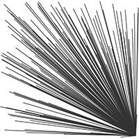
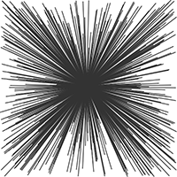
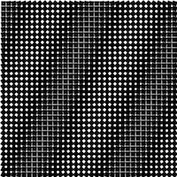
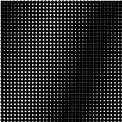
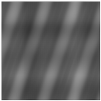
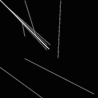
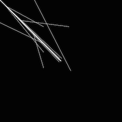

# Marianne's Sketches

## Random

[drawing 3](Marianne/Random/random3.pv)

## Fibonacci

[drawing 2](Marianne/Fibonacci/fibonacci2.pv)

[drawing 3](Marianne/Fibonacci/fibonacci3.pv)

[drawing 4](Marianne/Fibonacci/fibonacci4.pv)

[drawing 5](Marianne/Fibonacci/fibonacci5.pv)

## Perlin Noise

## Recursive functions
            
