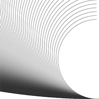

# Marianne's Sketches

## Random

[drawing 3](Marianne/Random/random3.pv)

## Fibonacci

[drawing 2](Marianne/Fibonacci/Fibonacci2.pv)

[drawing 3](Marianne/Fibonacci/Fibonacci3.pv)

[drawing 4](Marianne/Fibonacci/Fibonacci4.pv)

[drawing 5](Marianne/Fibonacci/Fibonacci5.pv)

## Perlin Noise

## Recursive functions
            
