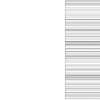
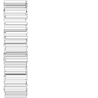
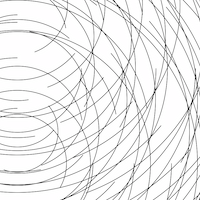

# Martijn's Sketches

## Fibonacci
 [fibo 1 ](Martijn/fibbonacci.pv)
[fibo 2 ](Martijn/fibbonacci2.pv)
[fibo 3 ](Martijn/fibbonacci9.pv)
[fibo 4 ](Martijn/fibonacci.pv)
[fibo 5 ](Martijn/fibbonacci8.pv)

##random

[random 1 ](Martijn/pnoiserandom.pv)

[random 2 ](Martijn/randomnoise2.pv)

[random 3 ](Martijn/randompnoise3.pv)

[random 4 ](Martijn/randompnoise4.pv)

[random 5 ](Martijn/random_pnoise5.pv)

## Perlin Noise

[perlin noise 1 ](Martijn/Untitled7.pv)

[perlin noise 2 ](Martijn/pnoise17.pv)

[perlin noise  3 ](Martijn/Untitled8.pv)

[perlin noise 4 ](Martijn/Untitled9.pv)

[perlin noise 5 ](Martijn/pnoiserandom6.pv)

## Recursive functions

[recursive 1 ](Martijn/recursion9.pv)

[recursive 2 ](Martijn/rucursion8.pv)

[recursive 3 ](Martijn/recursion4.pv)

[recursive 4 ](Martijn/recursion6.pv)

[recursive 5 ](Martijn/recursion7.pv)

[recursive 6 ](Martijn/recursion5.pv)

[recursive 7 ](Martijn/recursion4.pv)

[recursive 8 ](Martijn/recursion2.pv)

            
