# Nikki L's Sketches

## Fibonacci
<!---->

[drawing1](Nikki_L/test.pv)

[drawing2](Nikki_L/test2.pv)
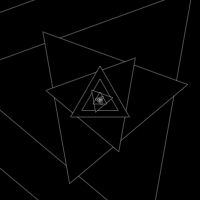
[drawing3](Nikki_L/test6.pv)
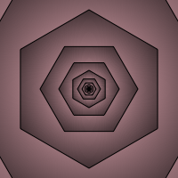
[drawing4](Nikki_L/test7.pv)

## Random
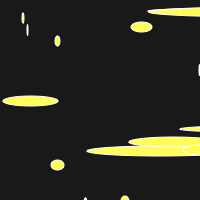
[drawing1](Nikki_L/test3.pv)
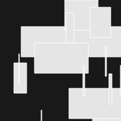
[drawing2](Nikki_L/test4.pv)
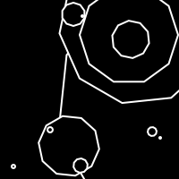
[drawing3](Nikki_L/test5.pv)
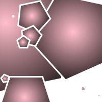
[drawing4](Nikki_L/test8.pv)
noise1
## Perlin Noise
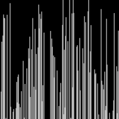
[drawing1](Nikki_L/noise1.pv)
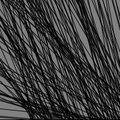
[drawing2](Nikki_L/noise2.pv)
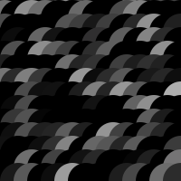
[drawing3](Nikki_L/noise3.pv)
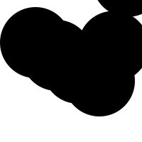
[drawing4](Nikki_L/noise4.pv)
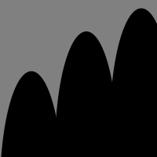
[drawing5](Nikki_L/noise5.pv)

## Recursive functions
            
