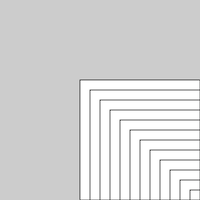
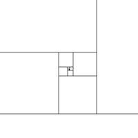
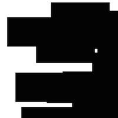
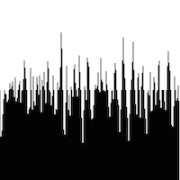
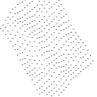

# Noa's Sketches

## Fibonacci

[Code](Noa/fibonacci.pv)

[bCode](Noa/fibonacci2.pv)

[Code](Noa/fibonacci3.pv)

[Code](Noa/fibonacci4.pv)

[Code](Noa/fibonacci5.pv)

## Random

[Code](Noa/random1.pv)

[Code](Noa/random2.pv)

[Code](Noa/random3.pv)

[Code](Noa/random4.pv)

[Code](Noa/random5.pv)

## Perlin Noise

[Code](Noa/bperlinnoise.pv)

[Code](Noa/perlinnoise2.pv)

[Code](Noa/perlinnoise3.pv)

[Code](Noa/perlinnoise4.pv)

[Code](Noa/perlinnoise5.pv)

## Recursive functions

[Code](Noa/rf.pv)
            