# Jasmijn's Sketches

## Fibonacci
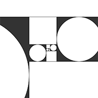
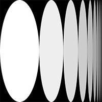
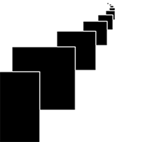

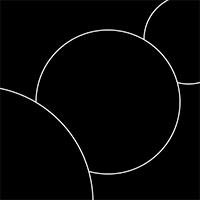
[drawing 5](Jasmijn/Fibonacci/fibo5.pv)
[drawing 6](Jasmijn/Fibonacci/fibo6.pv)
## Perlin Noise
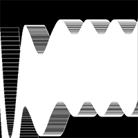
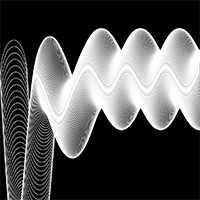
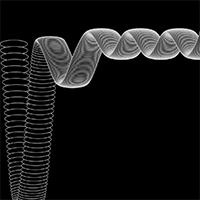
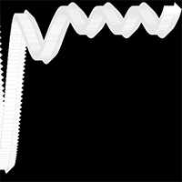
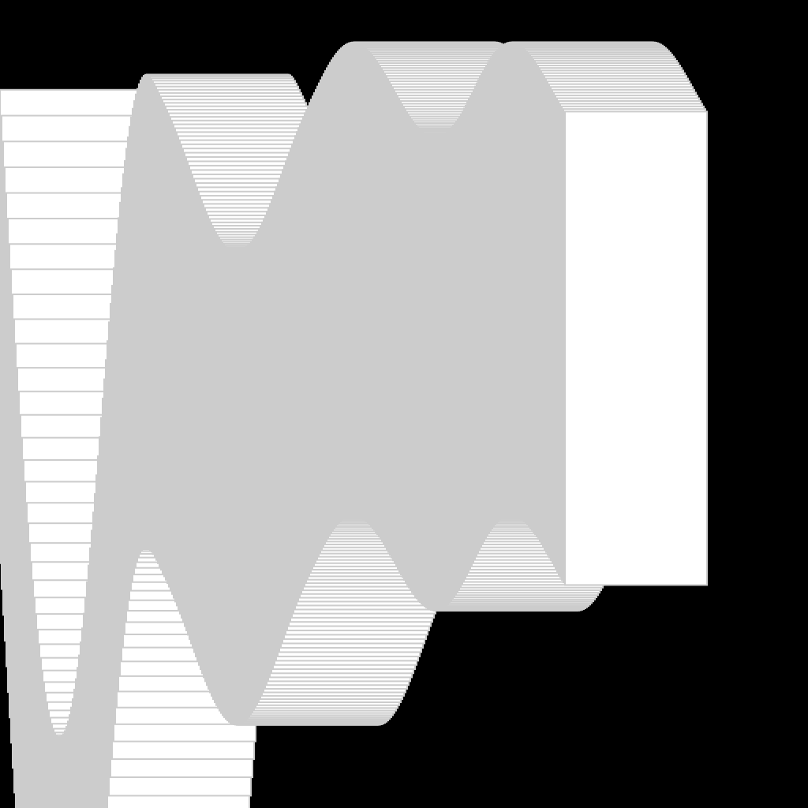
[drawing 5](Jasmijn/perlin noise/perlin_noise5.pv)
[drawing 4](Jasmijn/perlin noise/perlin4.pv)
[drawing 3](Jasmijn/perlin noise/perlin6.pv)

## Random 
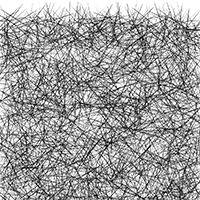
[drawing 1](Jasmijn/random/random1.pv)

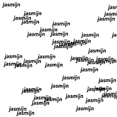
[drawing 2](Jasmijn/random/random2.pv)

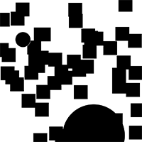
[drawing 3](Jasmijn/random/random3.pv)

[drawing 4](Jasmijn/random/random4.pv)

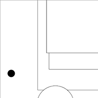
[drawing 5](Jasmijn/random/random5.pv)

## Recursive functions

            
